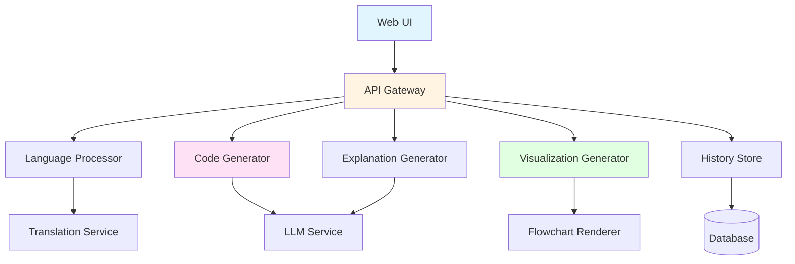

# Design Document: Visual Logic Translator

## Overview

The Visual Logic Translator is a web-based educational tool that bridges the gap between conceptual understanding and code implementation for B.Tech AI/DS students. The system accepts plain language descriptions of algorithms (in English or local languages), generates executable Python code, creates visual flowcharts, and provides educational explanations.

The architecture follows a pipeline design with four main stages:
1. **Input Processing**: Language detection, translation, and normalization
2. **Code Generation**: LLM-based translation from natural language to Python
3. **Visualization**: Flowchart generation from code structure
4. **Explanation**: Educational content generation linking concepts to implementation

The system prioritizes educational value over production-ready code, focusing on clarity, correctness, and pedagogical explanations.

## Architecture

### System Components



### Component Responsibilities

**Web UI**: Single-page application providing input forms, code display, flowchart rendering, and history management

**API Gateway**: RESTful API handling requests, orchestrating pipeline stages, managing sessions

**Language Processor**: Detects input language, translates to English if needed, normalizes text

**Code Generator**: Uses LLM to translate natural language descriptions into Python code with AI/DS library support

**Visualization Generator**: Parses Python AST to generate flowchart representations

**Explanation Generator**: Creates educational content explaining code logic and AI/DS concepts

**History Store**: Persists translation requests and outputs for user review

### Technology Stack

- **Frontend**: React with TypeScript, Monaco Editor for code display, Mermaid.js for flowcharts
- **Backend**: Python with FastAPI framework
- **LLM Integration**: OpenAI API or similar (GPT-4 for code generation)
- **Translation**: Google Translate API or similar for multi-language support
- **Database**: PostgreSQL for history storage
- **Code Analysis**: Python AST module for parsing generated code
- **Deployment**: Docker containers, cloud-hosted (AWS/GCP/Azure)

## Components and Interfaces

### 1. Language Processor

**Purpose**: Handle multi-language input and normalize text for processing

**Interface**:
```python
class LanguageProcessor:
    def detect_language(text: str) -> str
    def translate_to_english(text: str, source_lang: str) -> str
    def normalize_text(text: str) -> str
    def translate_from_english(text: str, target_lang: str) -> str
```

**Implementation Details**:
- Uses language detection library (langdetect) to identify input language
- Integrates with translation API for non-English inputs
- Preserves technical terms (AI/DS concepts) during translation using a glossary
- Normalizes whitespace, removes special characters that interfere with processing
- Caches translations to reduce API calls

**AI/DS Concept Glossary**:
- Maintains mapping of AI/DS terms across languages
- Examples: "linear regression" → "रैखिक प्रतिगमन" (Hindi)
- Ensures technical accuracy in translation

### 2. Code Generator

**Purpose**: Transform natural language descriptions into executable Python code

**Interface**:
```python
class CodeGenerator:
    def generate_code(description: str, context: dict) -> GeneratedCode
    def validate_syntax(code: str) -> ValidationResult
    def add_comments(code: str, description: str) -> str
    def format_code(code: str) -> str
```

**Data Structures**:
```python
@dataclass
class GeneratedCode:
    code: str
    imports: list[str]
    functions: list[str]
    main_logic: str
    comments: dict[int, str]  # line_number -> comment
```

**Implementation Details**:
- Uses LLM with specialized prompt engineering for educational code generation
- Prompt includes:
  - Instruction to generate clear, commented Python code
  - Emphasis on AI/DS libraries (numpy, pandas, scikit-learn)
  - Request for PEP 8 compliance
  - Instruction to include example data/usage
- Post-processes LLM output to ensure syntax validity
- Adds line-by-line comments explaining logic
- Formats code using Black or autopep8
- Validates generated code doesn't contain security issues (no eval, exec, file system access without context)

**AI/DS Concept Recognition**:
- Maintains pattern matching for common AI/DS terms
- Maps concepts to appropriate library implementations:
  - "linear regression" → sklearn.linear_model.LinearRegression
  - "decision tree" → sklearn.tree.DecisionTreeClassifier
  - "k-means" → sklearn.cluster.KMeans
  - "data normalization" → sklearn.preprocessing.StandardScaler

### 3. Visualization Generator

**Purpose**: Create flowcharts from generated Python code

**Interface**:
```python
class VisualizationGenerator:
    def generate_flowchart(code: str) -> Flowchart
    def parse_code_structure(code: str) -> CodeStructure
    def create_mermaid_diagram(structure: CodeStructure) -> str
```

**Data Structures**:
```python
@dataclass
class CodeStructure:
    nodes: list[FlowNode]
    edges: list[FlowEdge]
    
@dataclass
class FlowNode:
    id: str
    type: NodeType  # START, END, PROCESS, DECISION, LOOP
    label: str
    code_lines: list[int]
    
@dataclass
class Flowchart:
    mermaid_code: str
    svg_data: str
    node_mapping: dict[str, list[int]]  # node_id -> code_lines
```

**Implementation Details**:
- Parses Python code using AST module
- Identifies control flow structures:
  - Function definitions → START/END nodes
  - If/elif/else → DECISION nodes
  - For/while loops → LOOP nodes
  - Assignments/operations → PROCESS nodes
- Generates Mermaid.js syntax for flowchart
- Creates bidirectional mapping between flowchart nodes and code lines
- Simplifies complex nested structures for readability
- Limits flowchart complexity (max 20 nodes) by abstracting function calls

**Flowchart Generation Algorithm**:
1. Parse code into AST
2. Walk AST to identify control flow nodes
3. Build graph structure with nodes and edges
4. Simplify graph (combine sequential operations)
5. Generate Mermaid syntax
6. Render to SVG for display

### 4. Explanation Generator

**Purpose**: Create educational explanations linking concepts to code

**Interface**:
```python
class ExplanationGenerator:
    def generate_explanation(code: str, description: str, flowchart: Flowchart) -> Explanation
    def explain_concept(concept: str) -> str
    def map_description_to_code(description: str, code: str) -> list[Mapping]
```

**Data Structures**:
```python
@dataclass
class Explanation:
    overview: str
    step_by_step: list[ExplanationStep]
    concept_explanations: dict[str, str]
    code_mappings: list[Mapping]
    
@dataclass
class ExplanationStep:
    step_number: int
    description: str
    code_lines: list[int]
    flowchart_nodes: list[str]
    
@dataclass
class Mapping:
    description_text: str
    code_lines: list[int]
    explanation: str
```

**Implementation Details**:
- Uses LLM to generate educational explanations
- Prompt includes:
  - Original description
  - Generated code
  - Flowchart structure
  - Request for step-by-step breakdown
  - Request for concept explanations in simple terms
- Identifies AI/DS concepts mentioned in code
- Generates plain-language explanations of mathematical/statistical concepts
- Creates mappings between description phrases and code sections
- Highlights why specific code patterns were chosen

### 5. History Store

**Purpose**: Persist and retrieve translation history

**Interface**:
```python
class HistoryStore:
    def save_translation(user_id: str, translation: Translation) -> str
    def get_user_history(user_id: str, limit: int) -> list[Translation]
    def get_translation(translation_id: str) -> Translation
    def delete_translation(translation_id: str) -> bool
```

**Data Structures**:
```python
@dataclass
class Translation:
    id: str
    user_id: str
    timestamp: datetime
    input_language: str
    original_description: str
    english_description: str
    generated_code: str
    flowchart: Flowchart
    explanation: Explanation
```

**Database Schema**:
```sql
CREATE TABLE translations (
    id UUID PRIMARY KEY,
    user_id VARCHAR(255) NOT NULL,
    timestamp TIMESTAMP NOT NULL,
    input_language VARCHAR(10),
    original_description TEXT NOT NULL,
    english_description TEXT,
    generated_code TEXT NOT NULL,
    flowchart_data JSONB,
    explanation_data JSONB,
    INDEX idx_user_timestamp (user_id, timestamp DESC)
);
```

### 6. API Gateway

**Purpose**: Orchestrate the translation pipeline and handle HTTP requests

**REST Endpoints**:
```
POST /api/translate
  Request: { description: string, language?: string }
  Response: { translation_id: string, code: string, flowchart: string, explanation: object }

GET /api/history
  Query: { user_id: string, limit?: number }
  Response: { translations: array }

GET /api/translation/:id
  Response: { translation: object }

DELETE /api/translation/:id
  Response: { success: boolean }

POST /api/execute
  Request: { code: string }
  Response: { output: string, errors?: string }
```

**Pipeline Orchestration**:
```python
async def process_translation(description: str, user_id: str) -> Translation:
    # Stage 1: Language Processing
    detected_lang = language_processor.detect_language(description)
    english_desc = description
    if detected_lang != 'en':
        english_desc = language_processor.translate_to_english(description, detected_lang)
    normalized_desc = language_processor.normalize_text(english_desc)
    
    # Stage 2: Code Generation
    generated_code = code_generator.generate_code(normalized_desc, context={})
    validated_code = code_generator.validate_syntax(generated_code.code)
    if not validated_code.is_valid:
        raise CodeGenerationError(validated_code.errors)
    formatted_code = code_generator.format_code(generated_code.code)
    
    # Stage 3: Visualization
    flowchart = visualization_generator.generate_flowchart(formatted_code)
    
    # Stage 4: Explanation
    explanation = explanation_generator.generate_explanation(
        formatted_code, normalized_desc, flowchart
    )
    
    # Translate explanation back if needed
    if detected_lang != 'en':
        explanation = translate_explanation(explanation, detected_lang)
    
    # Stage 5: Storage
    translation = Translation(...)
    translation_id = history_store.save_translation(user_id, translation)
    
    return translation
```

## Data Models

### Core Domain Models

**LogicDescription**:
```python
@dataclass
class LogicDescription:
    text: str
    language: str
    normalized_text: str
    detected_concepts: list[str]
    
    def validate(self) -> bool:
        return len(self.text.strip()) > 0 and len(self.text) <= 5000
```

**PythonCode**:
```python
@dataclass
class PythonCode:
    source: str
    imports: list[str]
    functions: list[FunctionDef]
    ast_tree: ast.Module
    
    def get_line_count(self) -> int
    def has_syntax_errors(self) -> bool
    def get_complexity(self) -> int
```

**FlowchartNode**:
```python
class NodeType(Enum):
    START = "start"
    END = "end"
    PROCESS = "process"
    DECISION = "decision"
    LOOP = "loop"
    INPUT_OUTPUT = "io"

@dataclass
class FlowchartNode:
    id: str
    type: NodeType
    label: str
    code_lines: list[int]
    position: tuple[int, int]  # for rendering
```

### Validation Rules

**Input Validation**:
- Description length: 1-5000 characters
- Supported languages: en, hi, ta, te, bn
- No executable code in description (security)

**Code Validation**:
- Must parse as valid Python AST
- No dangerous imports (os.system, subprocess, eval, exec)
- No file system operations without explicit context
- Maximum complexity score: 20 (cyclomatic complexity)

**Flowchart Validation**:
- Maximum 20 nodes (for readability)
- All nodes must be reachable from START
- All paths must reach END
- No orphaned nodes

## Correctness Properties

*A property is a characteristic or behavior that should hold true across all valid executions of a system—essentially, a formal statement about what the system should do. Properties serve as the bridge between human-readable specifications and machine-verifiable correctness guarantees.*


### Property 1: Valid Input Acceptance
*For any* Logic_Description in a supported language (English, Hindi, Tamil, Telugu, Bengali) with length between 1 and 5000 characters, the System should accept and process the input without errors.
**Validates: Requirements 1.1, 1.2, 1.4**

### Property 2: Invalid Input Rejection
*For any* string composed entirely of whitespace characters or exceeding 5000 characters, the System should reject the input and return a descriptive error message.
**Validates: Requirements 1.3, 1.4**

### Property 3: Input Storage Round-Trip
*For any* accepted Logic_Description, storing it and then retrieving it should return an equivalent description.
**Validates: Requirements 1.5**

### Property 4: Syntactically Valid Code Generation
*For any* valid Logic_Description that is successfully processed, the generated Python code should parse without syntax errors using Python's AST parser.
**Validates: Requirements 2.1**

### Property 5: Complete Import Statements
*For any* generated Python code, all non-built-in names used in the code should either be imported or defined within the code itself.
**Validates: Requirements 2.3**

### Property 6: PEP 8 Compliance
*For any* generated Python code, running a PEP 8 linter should produce no critical style violations.
**Validates: Requirements 2.4**

### Property 7: Code Contains Comments
*For any* generated Python code with more than 5 lines, inline comments should be present and distributed throughout the code (not just at the beginning).
**Validates: Requirements 2.5**

### Property 8: Error Messages on Failure
*For any* code generation failure, the System should return a non-empty error message explaining the failure reason.
**Validates: Requirements 2.6, 7.5**

### Property 9: Code-Flowchart Coupling
*For any* successfully generated Python code, a corresponding flowchart should also be generated.
**Validates: Requirements 3.1**

### Property 10: Flowchart Structural Correctness
*For any* generated flowchart from Python code containing if-statements, loops, or function definitions, the flowchart should contain corresponding decision nodes, loop nodes, or start/end nodes with correct node types and non-empty labels.
**Validates: Requirements 3.2, 3.3, 3.4, 3.6**

### Property 11: Flowchart Rendering Format
*For any* generated flowchart, the output should be valid Mermaid syntax or valid SVG that can be parsed without errors.
**Validates: Requirements 3.5**

### Property 12: AI/DS Concept Recognition and Implementation
*For any* Logic_Description containing recognized AI/DS concepts (linear regression, decision tree, k-means, data normalization, etc.), the generated code should import and use appropriate libraries (scikit-learn, pandas, numpy) for those concepts.
**Validates: Requirements 4.1, 4.2, 4.3**

### Property 13: AI/DS Code Includes Example Data
*For any* generated code implementing AI/DS operations, the code should include example data, placeholder variables, or comments indicating where data should be provided.
**Validates: Requirements 4.4**

### Property 14: AI/DS Code Includes Conceptual Comments
*For any* generated code using AI/DS concepts, comments should be present that explain the mathematical or statistical basis of the operations.
**Validates: Requirements 4.5**

### Property 15: Explanation Completeness
*For any* successfully generated code and flowchart, the explanation should include an overview, mappings between description and code, and explanations for each major code block or function.
**Validates: Requirements 5.1, 5.2, 5.3**

### Property 16: Flowchart-Code Line Mapping
*For any* generated flowchart, each flowchart node should map to valid line numbers in the generated code (line numbers within the code's range).
**Validates: Requirements 5.4**

### Property 17: AI/DS Concept Explanations
*For any* generated code that uses AI/DS concepts, the explanation should include simple-term descriptions of those concepts.
**Validates: Requirements 5.5**

### Property 18: Language Detection Accuracy
*For any* input text in a supported language, the detected language should match the actual language of the text.
**Validates: Requirements 6.1**

### Property 19: Multi-Language Round-Trip
*For any* Logic_Description in a Local_Language, the System should translate it to English for processing and provide explanations in the original input language.
**Validates: Requirements 6.2, 6.5**

### Property 20: Security - No Dangerous Code
*For any* generated Python code, it should not contain dangerous operations (eval, exec, os.system, subprocess calls, arbitrary file operations, or network requests) unless explicitly requested in the Logic_Description.
**Validates: Requirements 8.1, 8.5**

### Property 21: Error Handling Presence
*For any* generated Python code that processes external input or performs operations that can fail, the code should include error handling (try/except blocks or validation checks).
**Validates: Requirements 8.2**

### Property 22: Input Validation in Data Processing
*For any* generated code that accepts user input or processes data, the code should include validation logic (type checks, range checks, or null checks).
**Validates: Requirements 8.4**

### Property 23: Code Execution Returns Results
*For any* generated Python code that is executed in the optional execution environment, the execution should return output or results without raising unhandled exceptions.
**Validates: Requirements 9.5**

### Property 24: Translation History Round-Trip
*For any* Translation saved to history, retrieving it by ID should return all components (Logic_Description, Python_Code, Flowchart, Explanation) with equivalent content.
**Validates: Requirements 10.1, 10.3**

### Property 25: History Retrieval Completeness
*For any* user who has saved N translations, requesting their history should return N translations with valid timestamps in descending order.
**Validates: Requirements 10.2, 10.4**

### Property 26: History Deletion Effectiveness
*For any* translation in history, after deletion, requesting that translation by ID should return a not-found error, and it should not appear in the user's history list.
**Validates: Requirements 10.5**

## Error Handling

### Error Categories

**Input Validation Errors**:
- Empty or whitespace-only descriptions
- Descriptions exceeding length limits
- Unsupported languages
- Malicious input patterns

**Processing Errors**:
- Translation API failures
- LLM API failures or timeouts
- Code generation failures (unable to produce valid code)
- Flowchart generation failures (code too complex)

**System Errors**:
- Database connection failures
- Storage failures
- Authentication/authorization failures

### Error Response Format

All errors follow a consistent structure:
```python
@dataclass
class ErrorResponse:
    error_code: str
    message: str
    details: dict
    suggestions: list[str]
    timestamp: datetime
```

### Error Handling Strategies

**Graceful Degradation**:
- If flowchart generation fails, still return code and explanation
- If explanation generation fails, still return code and flowchart
- If translation fails, attempt processing in original language

**Retry Logic**:
- LLM API calls: 3 retries with exponential backoff
- Translation API calls: 2 retries with 1-second delay
- Database operations: 2 retries for transient failures

**User Feedback**:
- Provide specific, actionable error messages
- Suggest corrections for common input mistakes
- Offer examples of well-formed descriptions

**Logging and Monitoring**:
- Log all errors with context (user_id, input, stack trace)
- Monitor error rates by category
- Alert on elevated error rates or critical failures

### Validation Pipeline

```python
def validate_input(description: str) -> ValidationResult:
    errors = []
    
    # Length validation
    if len(description.strip()) == 0:
        errors.append("Description cannot be empty")
    if len(description) > 5000:
        errors.append("Description exceeds 5000 character limit")
    
    # Security validation
    dangerous_patterns = ['eval(', 'exec(', '__import__', 'os.system']
    for pattern in dangerous_patterns:
        if pattern in description.lower():
            errors.append(f"Description contains potentially dangerous pattern: {pattern}")
    
    # Language validation
    detected_lang = detect_language(description)
    if detected_lang not in SUPPORTED_LANGUAGES:
        errors.append(f"Language '{detected_lang}' is not supported")
    
    return ValidationResult(is_valid=len(errors) == 0, errors=errors)
```

## Testing Strategy

### Dual Testing Approach

The Visual Logic Translator requires both unit testing and property-based testing for comprehensive coverage:

**Unit Tests**: Focus on specific examples, edge cases, and integration points
- Example inputs with known correct outputs
- Edge cases (empty input, maximum length, special characters)
- Error conditions (API failures, invalid responses)
- Integration between components

**Property-Based Tests**: Verify universal properties across all inputs
- Generate random valid descriptions and verify properties hold
- Test with random code structures for flowchart generation
- Verify round-trip properties (storage, translation)
- Test security properties with generated inputs

### Property-Based Testing Configuration

**Framework**: Use Hypothesis (Python) for property-based testing

**Configuration**:
- Minimum 100 iterations per property test
- Each test tagged with: **Feature: visual-logic-translator, Property {N}: {property_text}**
- Custom generators for domain-specific data (Logic_Descriptions, AI/DS concepts)

**Example Property Test Structure**:
```python
from hypothesis import given, strategies as st

@given(st.text(min_size=1, max_size=5000))
def test_valid_input_acceptance(description):
    """
    Feature: visual-logic-translator, Property 1: Valid Input Acceptance
    For any Logic_Description with length 1-5000, system should accept it
    """
    result = system.process_input(description)
    assert result.is_accepted or result.has_valid_error
```

### Test Coverage Requirements

**Unit Test Coverage**:
- Language detection: Test each supported language with examples
- Code generation: Test common AI/DS concepts (regression, clustering, trees)
- Flowchart generation: Test different control structures (if, loops, functions)
- Error handling: Test each error category
- API endpoints: Test all REST endpoints with valid/invalid inputs

**Property Test Coverage**:
- All 26 correctness properties must have corresponding property tests
- Each property test must run minimum 100 iterations
- Custom generators for:
  - Valid Logic_Descriptions (various lengths, languages)
  - AI/DS concept mentions
  - Python code structures
  - Flowchart structures

### Integration Testing

**End-to-End Flows**:
1. Submit English description → Verify code, flowchart, explanation generated
2. Submit Hindi description → Verify translation, code generation, Hindi explanation
3. Submit AI/DS concept → Verify appropriate library usage
4. Save to history → Verify retrieval
5. Delete from history → Verify removal

**External Service Mocking**:
- Mock LLM API responses for consistent testing
- Mock translation API for language testing
- Mock database for storage testing

### Performance Testing

**Load Testing**:
- Concurrent translation requests (target: 100 requests/second)
- Large description processing (5000 characters)
- History retrieval with large datasets (1000+ translations)

**Latency Requirements**:
- Code generation: < 5 seconds for typical descriptions
- Flowchart generation: < 1 second
- History retrieval: < 500ms
- Total pipeline: < 10 seconds

### Security Testing

**Input Validation**:
- Test injection attempts (SQL, code injection)
- Test XSS patterns in descriptions
- Test path traversal attempts

**Code Generation Safety**:
- Verify no dangerous operations in generated code
- Test with malicious description patterns
- Verify sandbox execution (if execution feature enabled)

## Deployment Considerations

### Infrastructure

**Containerization**:
- Docker containers for backend services
- Separate containers for: API Gateway, Code Generator, Visualization Generator
- Container orchestration with Kubernetes

**Scalability**:
- Horizontal scaling for API Gateway (stateless)
- Queue-based processing for long-running code generation
- Caching layer (Redis) for translation results and common patterns

**Database**:
- PostgreSQL for translation history
- Read replicas for history queries
- Regular backups and point-in-time recovery

### Monitoring and Observability

**Metrics**:
- Request rate and latency by endpoint
- Code generation success/failure rates
- LLM API usage and costs
- Translation API usage
- Error rates by category

**Logging**:
- Structured logging (JSON format)
- Log levels: DEBUG, INFO, WARNING, ERROR, CRITICAL
- Correlation IDs for request tracing

**Alerting**:
- High error rates (>5% of requests)
- Elevated latency (>10 seconds)
- External API failures
- Database connection issues

### Security

**Authentication**:
- JWT-based authentication for API requests
- Session management for web UI
- Rate limiting per user (10 requests/minute)

**Data Privacy**:
- Encrypt sensitive data at rest
- Encrypt data in transit (TLS)
- User data isolation (row-level security)
- GDPR compliance (data deletion, export)

**API Security**:
- Input validation and sanitization
- CORS configuration for web UI
- API key rotation for external services
- Secrets management (AWS Secrets Manager, HashiCorp Vault)

## Future Enhancements

**Potential Extensions**:
1. Support for more programming languages (Java, JavaScript, C++)
2. Interactive code editing with live flowchart updates
3. Collaborative features (share translations, comment)
4. Integration with Jupyter notebooks
5. Mobile application
6. Voice input for descriptions
7. Video explanations of concepts
8. Gamification (achievements, progress tracking)
9. Integration with learning management systems (LMS)
10. Support for more local languages

**AI/ML Improvements**:
1. Fine-tuned models for educational code generation
2. Personalized explanations based on user level
3. Concept prerequisite detection and suggestions
4. Automatic difficulty assessment
5. Learning path recommendations
